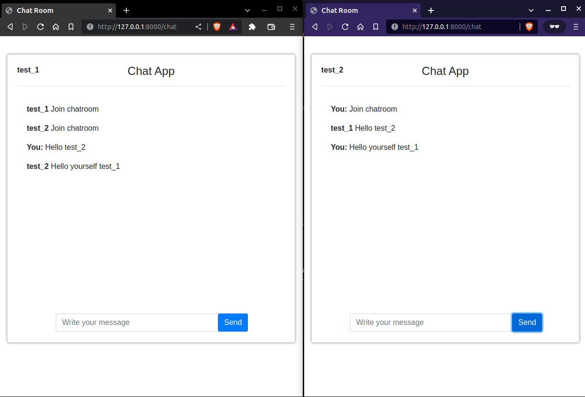

<h1>FastAPI websocket chat room</h1>

Dockerized FastAPI chat room - build with websockets.<br>
Multiple users can chat in same room (separate web browser instances) with live content update by websocket connection.<br>

JQuery (for testing) on front side, will be replaced by Vue3 shortly.


## Installation

Install codebase:

```
$ git clone https://github.com/forDeFan/FastAPI_live_chat.git
$ cd FastAPI_live_chat
```

### To run with docker

```
$ docker-compose up -d
```

### To run locally without docker

Recommended - create virtual environment and install dependencies

```
pip install -r requirements.txt
```

While in project root

```
$ uvicorn app.backend.main:app --reload
```

Docs available at<br>http://127.0.0.1:8000/docs


## Interaction

Go to: http://127.0.0.1:8000 <br>
Set up your nick (it will be placed into cookie) and chat with other users in same room.<br>
Separate user session can be simulated by separate web browser instances connecting to 127.0.0.1:8000.<br>
<br>
<p align=center>

</p>
